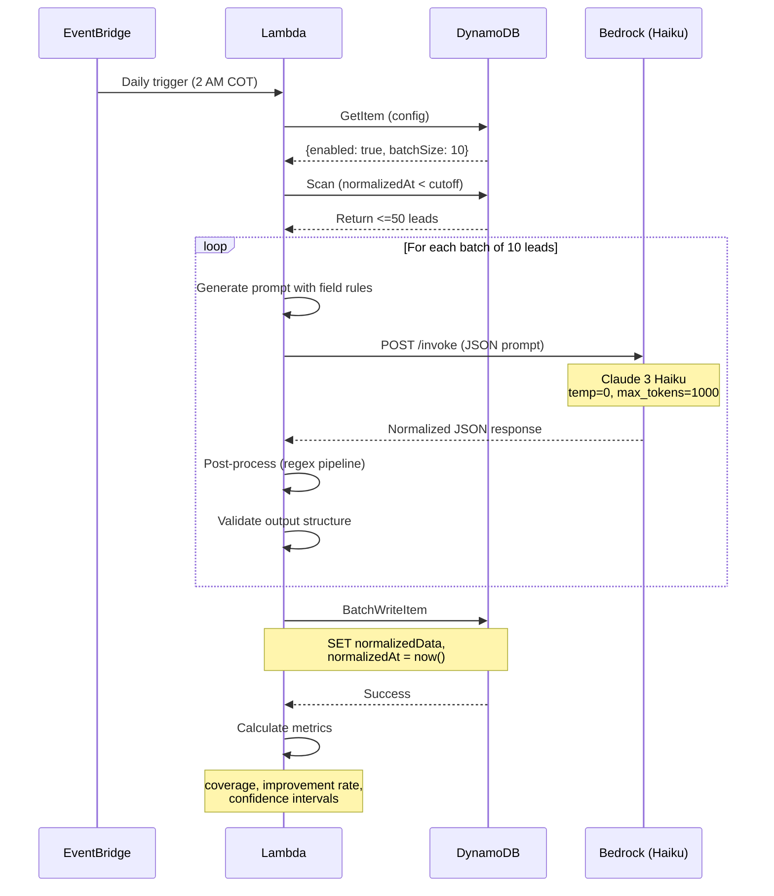
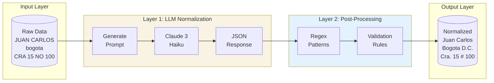
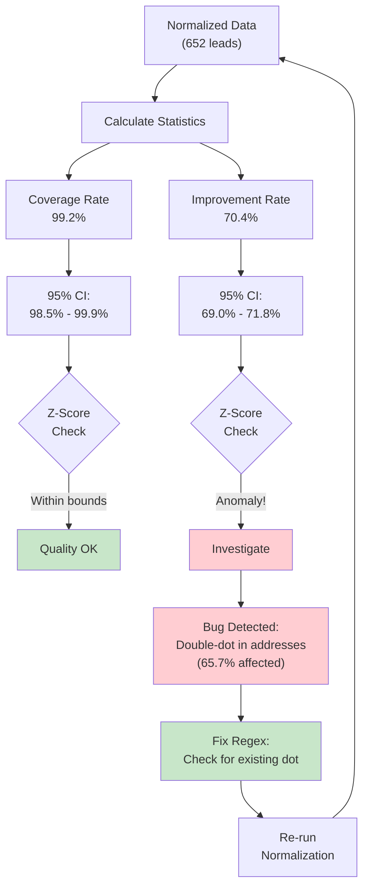
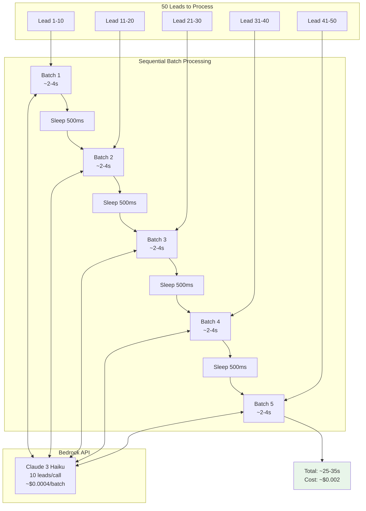
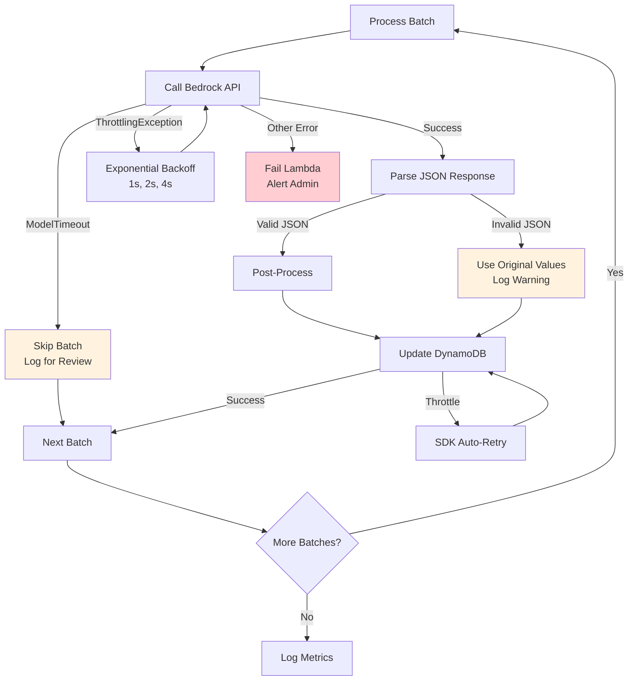
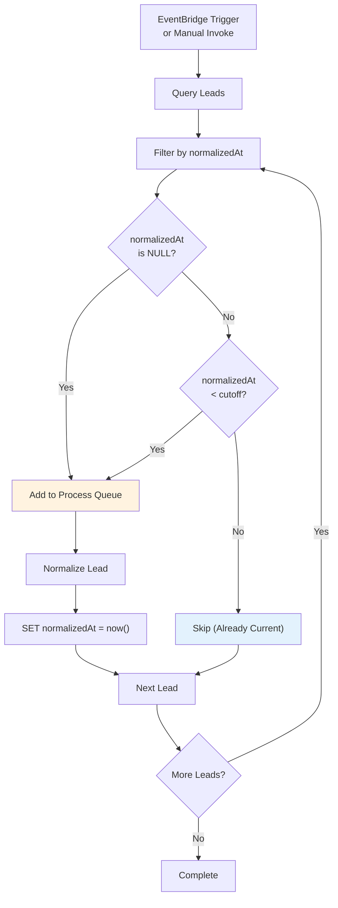

# Mermaid Sequence Diagrams

This document contains Mermaid diagrams for the LLM-Powered Data Normalization ETL pattern.
These diagrams can be rendered directly in GitHub, VS Code, or any Markdown viewer that supports Mermaid.

## 1. Normalization Sequence Diagram

This diagram shows the complete flow from EventBridge trigger to data storage.



## 2. Data Flow Diagram

This diagram shows how data transforms through the dual-layer architecture.



## 3. Statistical Validation Flow

This diagram shows how statistical validation detects bugs and quality issues.



## 4. Batch Processing Flow

This diagram shows how leads are processed in batches to optimize API costs.



## 5. Error Handling Flow

This diagram shows the error handling strategy for different failure scenarios.



## 6. Idempotency Check Flow

This diagram shows how the system ensures idempotent processing.



## Usage

### In GitHub/GitLab

Mermaid diagrams render automatically in Markdown files on GitHub and GitLab.
Just copy the code blocks above into your documentation.

### In VS Code

Install the "Markdown Preview Mermaid Support" extension to preview Mermaid diagrams.

### Export to PNG

Use the Mermaid CLI to export diagrams:

```bash
# Install mermaid-cli
npm install -g @mermaid-js/mermaid-cli

# Export a diagram
mmdc -i sequences.md -o diagram.png
```

### Live Editor

Use the Mermaid Live Editor to preview and customize diagrams:
https://mermaid.live/
