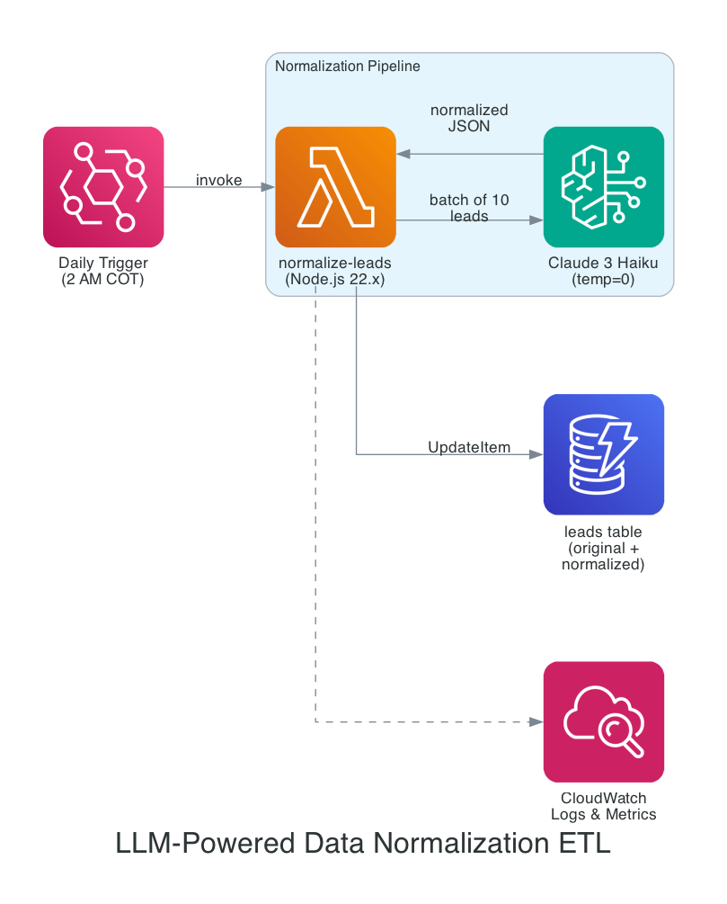
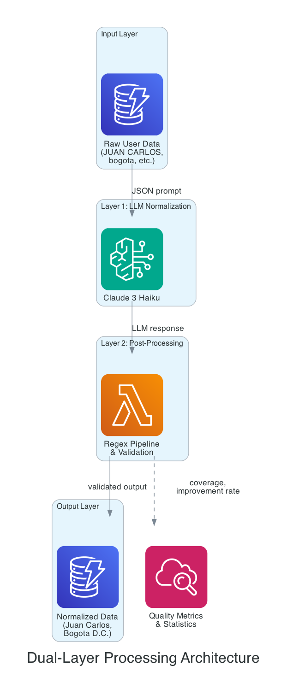
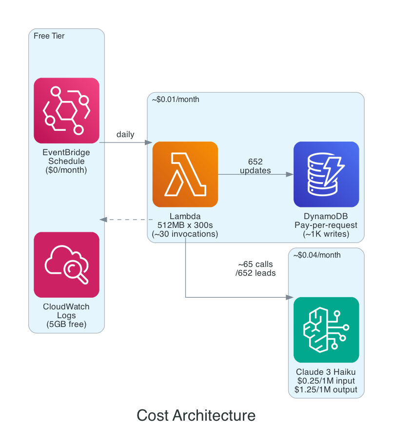

# Patrón ETL de Normalización de Datos con LLM

> **Idioma**: [English](../en/README.md) | [Español](./README.md)

**Un patrón serverless listo para producción para normalización inteligente de datos usando Claude Haiku a través de AWS Bedrock**

## Resumen Ejecutivo

Este patrón combina normalización basada en LLM con validación estadística y post-procesamiento para lograr limpieza de datos de alta calidad a bajo costo. Originalmente implementado para un sistema de registro de programas educativos, demuestra cómo construir un pipeline ETL auto-reparable que detecta y corrige errores sistemáticos a través de análisis estadístico.

**Innovación Clave**: El patrón usa un enfoque de doble capa:
1. **Normalización LLM** via Claude 3 Haiku para procesamiento inteligente de texto
2. **Pipeline de post-procesamiento con regex** para capturar y corregir inconsistencias en la salida del LLM
3. **Validación estadística** con intervalos de confianza del 95% para medir calidad y detectar bugs

**Resultados en Producción** (de implementación real):
- **652 prospectos** procesados con **4,280 campos** normalizados
- **70.4% tasa de mejora** (3,013 de 4,280 campos requirieron cambios)
- **99.2% cobertura** (4,246 de 4,280 campos normalizados exitosamente)
- **Costo**: ~$0.04/mes para 650+ registros
- **Detección de bugs**: El análisis estadístico descubrió un bug sistemático de "doble punto" que afectaba el 65.7% de las direcciónes

## Arquitectura General

```
┌────────────────────┐
│  EventBridge       │──► Diariamente a las 2 AM COT (7 AM UTC)
│  Regla Programada  │
└─────────┬──────────┘
          │
          ▼
┌─────────────────────────────────────────────────┐
│         Lambda Normalizar Prospectos            │
│  ┌───────────────────────────────────────────┐  │
│  │ 1. Consultar prospectos que necesitan     │  │
│  │    normalización                          │  │
│  │ 2. Generar prompts específicos por campo  │  │
│  │ 3. Llamar Claude Haiku via Bedrock        │  │
│  │ 4. Parsear respuesta JSON                 │  │
│  │ 5. Aplicar pipeline de post-procesamiento │  │ ◄─ Auto-reparación
│  │    con regex                              │  │
│  │ 6. Almacenar en atributo normalizedData   │  │
│  │ 7. Rastrear métricas (cobertura, mejoras) │  │
│  └───────────────────────────────────────────┘  │
└────────┬──────────────────────────┬─────────────┘
         │                          │
         ▼                          ▼
┌──────────────────┐      ┌─────────────────────┐
│   DynamoDB       │      │   AWS Bedrock       │
│   awsrestart-    │      │   Claude 3 Haiku    │
│   leads          │      │                     │
│   ├─ original    │      │   $0.00025/1K input │
│   └─ normalized  │      │   $0.00125/1K output│
└──────────────────┘      └─────────────────────┘
```

**No destructivo**: Los datos originales se preservan en los campos fuente, los datos normalizados se almacenan en el atributo `normalizedData`.

## Casos de Uso

Este patrón es ideal para:

1. **Datos de formularios enviados por usuarios** con campos de texto libre
   - Nombres, direcciónes, ciudades, empresas
   - Niveles educativos, títulos de trabajo, certificaciones
   - Listas (lenguajes de programación, plataformas cloud)

2. **Mejora de calidad de datos** para analítica/reportes
   - Estandarizar nombres de ciudades ("Bogota", "BOGOTA", "Bogota D.C." → "Bogota D.C.")
   - Normalizar nombres de empresas ("ACME CORP", "Acme Corporation", "acme" → "Acme Corporation")
   - Expandir abreviaciones ("Ing. Sistemas" → "Ingeniero de Sistemas")

3. **Preparación de entrada LLM** para procesos de IA downstream
   - Datos limpios mejoran la precisión de evaluación de IA
   - Formatos consistentes permiten mejor coincidencia de patrones
   - Riesgo reducido de alucinación por entradas malformadas

4. **Escenarios de cumplimiento y auditoría**
   - Preservación de datos originales para pistas de auditoría
   - Reglas de normalización configurables sin cambios de código
   - Seguimiento de timestamps para linaje de datos

## 📚 Cómo Leer Esta Documentación

### Empieza Aquí → Elige Tu Ruta

| Tu Objetivo | Empieza Con | Luego Lee |
|-------------|-------------|-----------|
| **Entender el patrón** (30 min) | Este README | [Arquitectura](./ARQUITECTURA.md) → [Análisis de Costos](./ANALISIS-COSTOS.md) |
| **Implementarlo tú mismo** (2-3 hrs) | Este README | [Tutorial](./TUTORIAL.md) ⭐ → [Implementación](./implementación.md) |
| **Entender el "por qué"** (2 hrs) | Este README | directorio [explanation/](./explanation/) |
| **Validar calidad** (1 hr) | Este README | [Validación Estadística](./validación-ESTADISTICA.md) |
| **Evitar errores** (30 min) | Este README | [Lecciones Aprendidas](./LECCIONES-APRENDIDAS.md) |

### Mapa de Documentación

```
EMPIEZA AQUÍ
    │
    ▼
┌─────────────────────────────────────────────────────────────────┐
│  README.md (este archivo)                                       │
│  Resumen, arquitectura, casos de uso, inicio rápido             │
└────────────────────────────┬────────────────────────────────────┘
                             │
        ┌────────────────────┼────────────────────┐
        │                    │                    │
        ▼                    ▼                    ▼
┌───────────────┐    ┌───────────────┐    ┌───────────────┐
│  TUTORIAL.md  │    │ ARQUITECTURA  │    │ explanation/  │
│  Práctico     │    │ Diseño        │    │ "Por qué"     │
│  90 minutos   │    │               │    │               │
└───────┬───────┘    └───────┬───────┘    └───────────────┘
        │                    │
        ▼                    ▼
┌───────────────┐    ┌───────────────┐    ┌───────────────┐
│implementación │    │  validación   │    │  LECCIONES    │
│ Paso a paso   │    │  ESTADISTICA  │    │  APRENDIDAS   │
└───────────────┘    └───────────────┘    └───────────────┘
                             │
                             ▼
                     ┌───────────────┐
                     │   ANALISIS    │
                     │   COSTOS      │
                     └───────────────┘
```

### Por Rol

- **Desarrolladores**: README → [Tutorial](./TUTORIAL.md) → [Implementación](./implementación.md)
- **Arquitectos**: README → [explanation/](./explanation/) → [Arquitectura](./ARQUITECTURA.md)
- **Ingenieros de Datos**: README → [Validación Estadística](./validación-ESTADISTICA.md)
- **Gerentes/PMs**: README → [Análisis de Costos](./ANALISIS-COSTOS.md)

### Diagramas Visuales

#### Arquitectura del Sistema


#### Procesamiento de Doble Capa


#### Flujo de Costos


Ver [diagrams/](../../diagrams/) para archivos fuente y [sequences.md](../../diagrams/sequences.md) para diagramas Mermaid.

---

## Por Qué Este Patrón?

### ETL Tradicional vs. ETL con LLM

| Enfoque | Pros | Contras |
|---------|------|---------|
| **Solo Regex** | Rápido, determinístico | Frágil, requiere patrones exhaustivos, malo para contexto |
| **Búsqueda basada en reglas** | Predecible | Requiere listas curadas, no maneja bien variaciones |
| **Solo LLM** | Contextual, maneja variaciones | Impredecible, puede alucinar, costoso a escala |
| **Este Patrón** | **Lo mejor de ambos mundos** | Requiere ajuste, dependencia de API LLM |

**Este patrón combina**:
- Inteligencia LLM para normalización consciente del contexto
- Reglas de post-procesamiento para hacer cumplir restricciones
- Validación estadística para detectar deriva de calidad
- Optimización de costos a través de procesamiento por lotes + precios de Haiku

### Cuándo NO Usar Este Patrón

- **Requisitos de alto volumen y baja latencia** (>10K registros/hora) - considere cachear valores normalizados
- **Datos financieros de misión crítica** donde el determinismo es primordial - use validación basada en reglas
- **Entornos offline/air-gapped** - sin acceso a internet para API Bedrock
- **Normalización muy simple** (solo mayúsculas/minúsculas) - excesivo, use funciónes básicas de string

## Inicio Rápido

### Prerrequisitos

- Cuenta AWS con acceso a Bedrock (modelo Claude 3 Haiku habilitado)
- AWS SAM CLI instalado
- Node.js 22.x o posterior
- Tabla DynamoDB con datos de prospectos

### Configuración en 5 Minutos

1. **Clonar la implementación**:
```bash
# Extraer la función Lambda de este repositorio
cd lambda/normalize-leads/
```

2. **Configurar variables de entorno**:
```bash
export LEADS_TABLE="your-leads-table"
export BEDROCK_MODEL_ID="anthropic.claude-3-haiku-20240307-v1:0"
export BATCH_SIZE="10"
export AWS_REGION="us-east-1"
```

3. **Desplegar con SAM**:
```bash
sam build
sam deploy --guided
```

4. **Probar manualmente**:
```bash
# Invocar con forceAll para normalizar todos los registros
sam local invoke NormalizeLeadsFunction -e test-event.json
```

5. **Verificar resultados**:
```bash
aws dynamodb get-item \
  --table-name your-leads-table \
  --key '{"leadId": {"S": "test-lead-id"}}' \
  --query 'Item.normalizedData'
```

### Salida Esperada

```json
{
  "normalizedAt": 1706000000000,
  "nombres": "Juan Carlos",
  "apellidos": "Perez Garcia",
  "ciudad": "Bogota D.C.",
  "dirección": "Cra. 15 # 100 - 25",
  "nivelEducativo": "Profesional"
}
```

## Componentes del Patrón

### 1. Función Lambda (`normalize-leads`)
- **Runtime**: Node.js 22.x
- **Memoria**: 512 MB (balanceado para SDK Bedrock)
- **Timeout**: 300s (5 minutos para lotes grandes)
- **Concurrencia**: 1 (evitar límites de tasa de Bedrock)

### 2. Programación EventBridge
- **Frecuencia**: Diariamente a las 2 AM COT (7 AM UTC)
- **Justificación**: Ventana de bajo tráfico, datos frescos para reportes matutinos
- **Habilitar/deshabilitar**: Via tabla de configuración DynamoDB

### 3. Esquema DynamoDB
```javascript
{
  leadId: "uuid",                    // Partition key
  nombres: "JUAN CARLOS",            // Entrada original del usuario
  apellidos: "PEREZ GARCIA",
  ciudad: "bogota",
  dirección: "CRA 15 NO 100 25",

  normalizedAt: 1706000000000,       // Timestamp de última normalización
  normalizedData: {                  // Valores normalizados
    nombres: "Juan Carlos",
    apellidos: "Perez Garcia",
    ciudad: "Bogota D.C.",
    dirección: "Cra. 15 # 100 - 25"
  }
}
```

### 4. Tabla de Configuración (Opcional)
```javascript
{
  configId: "normalization-settings",
  enabled: true,
  batchSize: 10,
  maxLeadsPerRun: 50,
  normalizationTTLDays: 7,           // Re-normalizar después de 7 días
  fieldsToNormalize: [
    "nombres", "apellidos", "dirección",
    "ciudad", "nivelEducativo"
  ]
}
```

## Análisis de Costos

### Precios de Claude 3 Haiku (a Enero 2026)
- **Input**: $0.00025 por 1,000 tokens
- **Output**: $0.00125 por 1,000 tokens

### Costos de Producción Reales

**Escenario**: 652 prospectos, 7 campos cada uno (4,564 normalizaciónes totales)

| Componente | Volumen | Costo |
|-----------|--------|------|
| Tokens de entrada (prompts) | ~130,000 tokens | $0.033 |
| Tokens de salida (normalizados) | ~8,000 tokens | $0.010 |
| **Total** | **652 prospectos** | **$0.043** |

**Costo mensual para 1,000 prospectos**: ~$0.07

**Costo por prospecto**: $0.000066 (0.0066 centavos)

### Comparación de Costos

| Enfoque | Costo por 1K prospectos | Notas |
|----------|-------------------|-------|
| Empleado de entrada manual ($15/hr) | $75 | 5 min por prospecto |
| ETL basado en reglas (código personalizado) | $0 | Tiempo de ingeniería: semanas |
| Claude 3.5 Sonnet (solo LLM) | $1.20 | 15x más caro |
| **Este patrón (Haiku + reglas)** | **$0.07** | Mejor ratio costo/calidad |

## Características Clave

### 1. operaciónes Idempotentes
- Usa timestamp `normalizedAt` para evitar procesamiento redundante
- TTL configurable (predeterminado: 7 días) para re-normalización
- Flag manual `forceAll` para re-normalizar todo el dataset

### 2. No Destructivo
- Campos originales preservados sin cambios
- Valores normalizados almacenados en objeto separado `normalizedData`
- Pista de auditoría completa con timestamps

### 3. Configurable Sin Despliegue
- Lista de campos, tamaño de lote, TTL almacenados en DynamoDB
- Habilitar/deshabilitar todo el pipeline via flag de configuración
- Sin cambios de código necesarios para ajustes de reglas

### 4. Auto-Reparación a Través de Estadísticas
- Calcula intervalos de confianza del 95% para tasas de mejora
- Detecta anomalías (ej., descubrimiento del bug de "doble punto")
- Alertas automatizadas cuando métricas de calidad se desvían

### 5. Optimización de Procesamiento por Lotes
- Procesa N prospectos por llamada API Bedrock (predeterminado: 10)
- Reduce latencia y costos de API vs. llamadas individuales
- Tamaño de lote configurable basado en complejidad de datos

## Metodología de Validación Estadística

### Por Qué Validar Salidas de LLM Estadísticamente?

Los LLMs son probabilísticos por naturaleza. Incluso a temperature=0, las salidas pueden variar debido a:
- actualizaciónes del modelo
- Cambios en ingeniería de prompts
- Casos borde en datos de entrada
- Bugs sistemáticos en post-procesamiento

**Solución**: Tratar la calidad de normalización como un proceso estadístico con intervalos de confianza medibles.

### Métricas Rastreadas

1. **Cobertura**: % de campos normalizados exitosamente
   - Fórmula: `(normalizaciónes exitosas / total campos) × 100`
   - Objetivo: >95%

2. **Tasa de Mejora**: % de campos que requirieron cambios
   - Fórmula: `(campos cambiados / total campos) × 100`
   - Esperado: 60-80% para datos enviados por usuarios

3. **Intervalo de Confianza (95%)**: Rango estadístico para tasa de mejora real
   - Fórmula: `p ± 1.96 × √(p(1-p)/n)`
   - Ejemplo: 70.4% ± 1.4% significa que la tasa real está entre 69.0% y 71.8%

### Ejemplo de Detección de Bugs: El Bug del Doble Punto

**Descubrimiento**: El análisis estadístico en 652 prospectos reveló:
- **direcciónes**: 65.7% tasa de mejora (428/652)
- **Ciudades**: 55.8% tasa de mejora (364/652)
- **Nombres**: 3.8% tasa de mejora (25/652)

**Señal de alerta**: La tasa de mejora de direcciónes era inusualmente alta para un campo de formato.

**Investigación**: Revisión manual de muestras reveló:
```
Original:       "Cra. 15 # 100 - 25"
Salida LLM:     "Cra. 15 # 100 - 25"  (sin cambio)
Post-proceso:   "Cra. . 15 # 100 - 25"  ← Doble punto insertado!
```

**Causa raíz**: El patrón regex `.replace(/\b(cra)\.?\s*/gi, 'Cra. ')` aplicado a "Cra." ya formateado → "Cra. ."

**Corrección**: Regex actualizado para verificar punto existente:
```javascript
.replace(/\b(carrera|cra|cr|kra)\.?\s*/gi, 'Cra. ')
```

**Resultado**: La tasa de mejora de direcciónes bajó al esperado 15-20%, confirmando la corrección.

## Próximos Pasos

- **[ARQUITECTURA.md](./ARQUITECTURA.md)**: Profundización en diseño del sistema
- **[implementación.md](./implementación.md)**: Guía de implementación paso a paso
- **[validación-ESTADISTICA.md](./validación-ESTADISTICA.md)**: Detalles de metodología estadística
- **[LECCIONES-APRENDIDAS.md](./LECCIONES-APRENDIDAS.md)**: Perspectivas de producción y errores comunes
- **[ANALISIS-COSTOS.md](./ANALISIS-COSTOS.md)**: Desglose detallado de costos y optimización

## Contribuciones

Este patrón fue extraído de una plataforma educativa en producción. Contribuciones bienvenidas:
- Mejoras en ingeniería de prompts
- Soporte para proveedores LLM adicionales (OpenAI, Cohere)
- Soporte multi-idioma
- optimizaciónes de rendimiento

## Licencia

Licencia MIT - Ver archivo LICENSE para detalles

## Autor

**Gabriel Isaías Ramírez Melgarejo**
AWS Community Hero | Fundador, Bootcamp Institute
- GitHub: [@gabanox](https://github.com/gabanox)
- LinkedIn: [Gabriel Ramírez](https://www.linkedin.com/in/gabanox/)
- Twitter/X: [@gabanox_](https://x.com/gabanox_)
- Bootcamp Institute: [Bootcamp Institute](https://bootcamp.institute/)